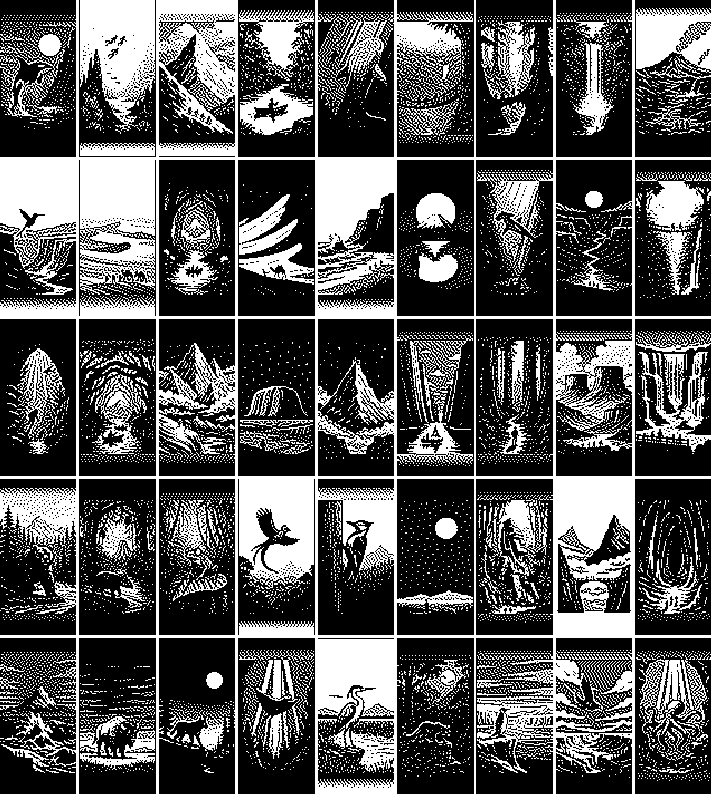

# Landscape Slideshow

This is a zmk module to implement a slideshow of 50 landscape and animal images based on the Hammerbean Slideshow project.

The picture to be displayed by this module on the peripheral screen will be one of these 50 and will change every 10 seconds.


<!--  -->

## Usage

To use this module, first add it to your config/west.yml by adding a new entry to remotes and projects:

```yml
manifest:
  remotes:
      # zmk official
    - name: zmkfirmware
      url-base: https://github.com/zmkfirmware
    - name: gpeye                         #new entry
      url-base: https://github.com/PiXeL16 #new entry
  projects:
    - name: zmk
      remote: zmkfirmware
      revision: main
      import: app/west.yml
    - name: zmk-landscape-slideshow          #new entry
      remote: PiXeL16                     #new entry
      revision: main                      #new entry
  self:
    path: config
```

Now simply swap out the default nice_view shield on the board for the custom one in your build.yaml file.

```yml
---
include:
  - board: nice_nano_v2
    shield: urchin_left nice_view_adapter  nice_view
  - board: nice_nano_v2
    shield: urchin_right nice_view_adapter nice_view_custom #custom shield
```

by default the this urchin animation will run for a duration of 300 seconds, 10 seconds per picture, fairly slow to save battery

If you want to change the speed of the animation, you can edit the speed by changing the CONFIG_CUSTOM_ANIMATION_SPEED in your .conf file

For example:

```conf
# urchin.conf
CONFIG_CUSTOM_ANIMATION_SPEED=300000 # 300 second total duration
# 30 pictures, so 10 seconds per picture
```